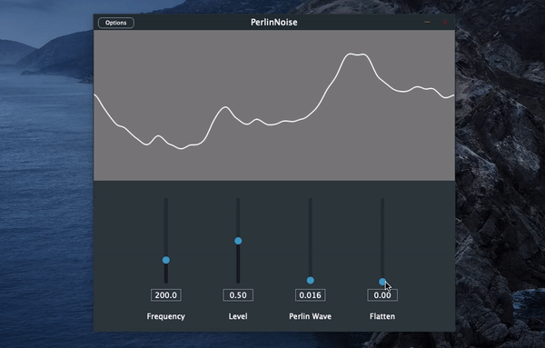

# Perlin Noise in C++

p5.js's Perlin noise implementation converted to C++ code. The noise() function behaves exactly the same although you need to construct an object in C++ to use it.
NoiseSeed(seed) changes the seed of the LCG from C++'s STL. You may use different PRNGs for different results.

Reference Implementation: 
https://github.com/processing/p5.js/blob/main/src/math/noise.js

## Wavetables with Perlin Noise
The Perlin-Noise directory contains a JUCE project with a wavetable oscillator  playing back a wavetable generated with Perlin noise values. The "Flatten" parameter interpolates between a sine wave and the previously generated wavetable to emphasize a possible use case for shaping wavetables. 

"Perlin Wave" is actually setting the increment of the x offset in the 1D Perlin noise() implementation and recalculating the wavetable. A higher increment will lead to bigger jumps between each sample and therefore creating more harmonics. Setting the increment to larger values will approach random noise as the relationship between adjacent values will be lost.

This plugin should only be considered demonstrating what Perlin noise might sound (and look) like when used in signal processing. Outputting a plane wavetable on a single frequency sounds horrible but using this approach for future projects on waveshaping could be interesting.

For more tutorials and explanations of Perlin Noise I would definitely recommend watching [Daniel Shiffman's](https://github.com/shiffman) nature of code videos: https://bit.ly/3qPlgsz
